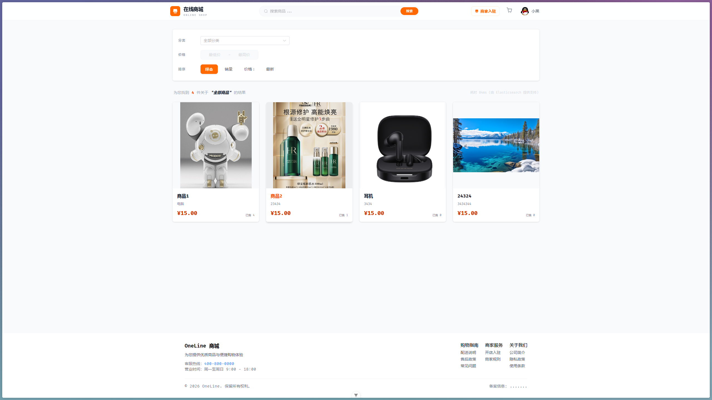
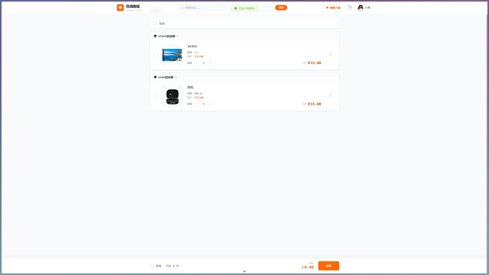
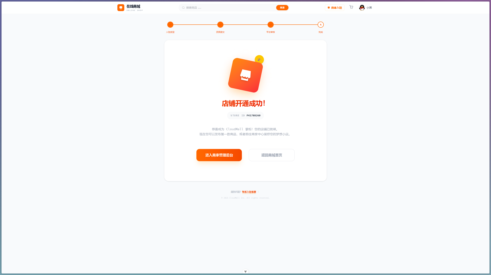
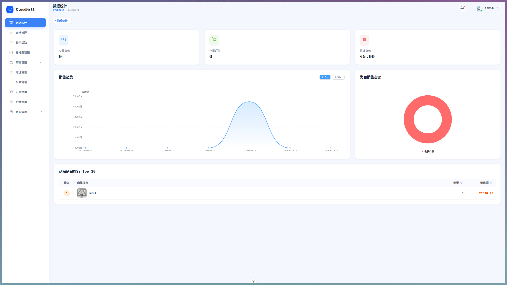
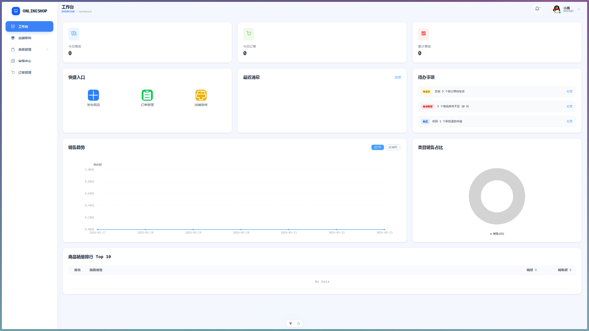

# online-mall

`online-mall` 是一个基于 Spring Boot 3 + MyBatis-Plus 的多端电商项目，包含用户端、管理端、商家端。

## 模块结构

| 模块                      | 说明                             | 默认端口 | 启动类                            |
| ------------------------- | -------------------------------- | -------- | --------------------------------- |
| `online-shop-framework`   | 核心领域模型、通用能力、共享组件 | -        | -                                 |
| `online-shop-web`         | 用户端 API                       | `7001`   | `CloudMallWebApplication`         |
| `online-shop-manager`     | 管理端 API                       | `7000`   | `CloudMallManageApplication`      |
| `online-shop-merchant`    | 商家端 API                       | `7002`   | `CloudMallMerchantApplication`    |
| `online-shop-aggregation` | 聚合启动模块                     | `7777`   | `CloudMallAggregationApplication` |
| `im`                      | 即时通讯模块                     | `7010`   | `IMApplication`                   |

## 前端UI

- 用户端（Web）：https://github.com/Tomatos03/cloud-mall-web
- 管理端（Manager）：https://github.com/Tomatos03/cloud-mall-manager
- 商家端（Merchant）：https://github.com/Tomatos03/cloud-mall-merchant

## 技术栈

- Spring Boot
- MyBatis-Plus
- MySQL
- Redis
- Elasticsearch
- RocketMQ
- MinIO
- WebSocket
- Redisson

## 环境准备

启动项目前请先准备以下依赖服务：

- MySQL
- Redis
- Elasticsearch
- RocketMQ
- MinIO

## 快速开始

### 1. 全量编译

```bash
mvn clean compile -DskipTests
```

### 2. 启动聚合端（推荐本地联调）

```bash
mvn -pl online-shop-aggregation spring-boot:run
```

聚合端默认 `local` 配置（见 `online-shop-aggregation/src/main/resources/application.yml`）。

### 3. 分模块启动（按需）

```bash
mvn -pl online-shop-manager spring-boot:run -Dspring-boot.run.profiles=local
mvn -pl online-shop-web spring-boot:run -Dspring-boot.run.profiles=local
mvn -pl online-shop-merchant spring-boot:run -Dspring-boot.run.profiles=local
mvn -pl im spring-boot:run
```

## 项目展示

### 用户端

- 首页：

- 商品搜索:

- 商品购物车:

- 商家入驻:


### 管理端

- 仪表盘：


### 商家端

